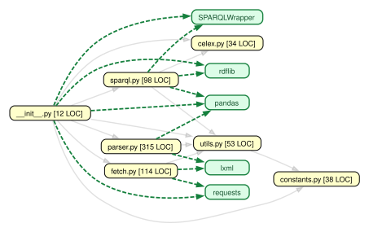

# EUR-Lex Parser

<p>
    <a href="https://github.com/kevin91nl/eurlex/actions/workflows/building.yaml"></a>
    <a href="https://badge.fury.io/py/eurlex"></a>
    <a href="./LICENSE"></a>
    <a href=https://github.com/ambv/black></a>
</p>

An EUR-Lex parser for Python.

## Usage

You can install this package as follows:

```bash
pip install -U eurlex
```

After installing this package, you can download and parse any document from EUR-Lex. For example, the [32019R0947 regulation](https://eur-lex.europa.eu/legal-content/EN/TXT/?uri=CELEX%3A32019R0947):

```python
from eurlex import get_html_by_celex_id, parse_html

# Retrieve and parse the document with CELEX ID "32019R0947" into a Pandas DataFrame
celex_id = "32019R0947"
html = get_html_by_celex_id(celex_id)
df = parse_html(html)

# Get the first line of Article 1
df_article_1 = df[df.article == "1"]
df_article_1_line_1 = df_article_1.iloc[0]

# Display the subtitle and corresponding text of Article 1
assert df_article_1_line_1.article_subtitle == "Subject matter"
assert df_article_1_line_1.text == (
    "This Regulation lays down detailed provisions for the operation of unmanned aircraft systems as well as for personnel, including remote pilots and organisations involved in those operations."
)
```

Every document on EUR-Lex displays a CELEX number at the top of the page. More information on CELEX numbers can be found on the [EUR-Lex website](https://eur-lex.europa.eu/content/tools/eur-lex-celex-infographic-A3.pdf).

For more information about the methods in this package, see the [unit tests](https://github.com/kevin91nl/eurlex/tree/main/tests) and [doctests](https://github.com/kevin91nl/eurlex/blob/main/src/eurlex/__init__.py).

### Data Structure

The following columns are available in the parsed dataframe:

- `text`: The text
- `type`: The type of the data
- `document`: The document in which the text is found
- `article`: The article in which the text is found
- `article_subtitle`: The subtitle of the article (when available)
- `ref`: The indentation level of the text within the article (e.g. `["(1)", "(a)"]` when the text is found under paragraph `(1)`, subparagraph `(a)`)

In some cases, additional fields are available. For example, the `group` field which contains the bold text under which a text is found.

## Architecture

The dependency graph below is generated by [`import-cruiser`](https://github.com/kevin91nl/import-cruiser) and refreshed by the pre-commit hook. It focuses on `src/eurlex` and its non-dev external dependencies, while keeping the public import surface available through `eurlex`.

### Module map

- `fetch.py`: download EUR-Lex HTML and resolve multiple-choice responses
- `parser.py`: turn HTML into tabular records
- `sparql.py`: build and run SPARQL queries
- `language.py`: language-code normalization
- `uri.py`: query-parameter and IRI helpers
- `markup.py`: XML and tag/class helpers
- `constants.py`: prefix and language-code tables



## Contributing

Feel free to send any issues, ideas or pull requests.

### Branching and pull requests

Please do your work on a feature branch that follows the `feature/*` naming pattern, for example `feature/my-new-improvement`.

When your work is ready, open a pull request from that feature branch to the target branch (typically `main`) for review.

### Local checks

For development, install the project and its hooks, then let pre-commit run the same checks that CI expects:

```bash
python -m pip install -e .[dev]
pre-commit install
pre-commit run --all-files
```

The final hook runs the doctests and enforces 100% coverage for `eurlex`, so you should see the same failures locally before a commit lands.

The README examples are also exercised automatically through `pytest-readme`, so they stay in sync with the code instead of becoming decorative fiction.

The runnable examples in `examples/` are executed by the test suite as well, so they are part of the coverage target rather than a separate side quest.

CI tests the package on Python 3.11, 3.12, and 3.13, while the pre-commit hooks keep the code quality checks on a single pinned environment.

Version tags that start with `v` — for example `v0.1.8` — now create a GitHub Release, attach the built distributions, and publish the package to PyPI after the checks pass.
